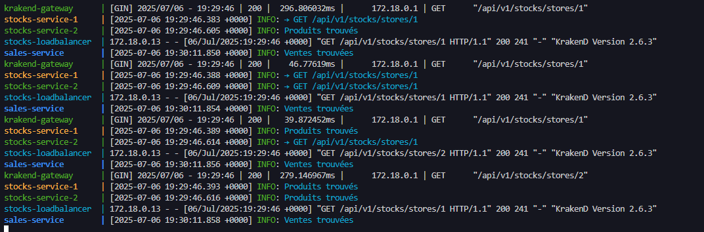
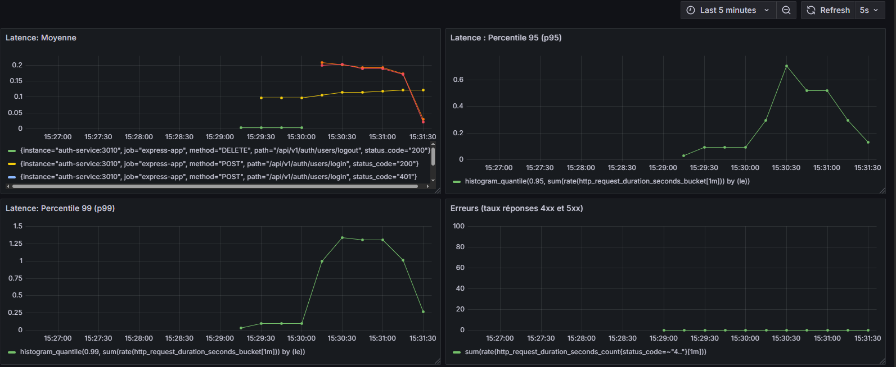
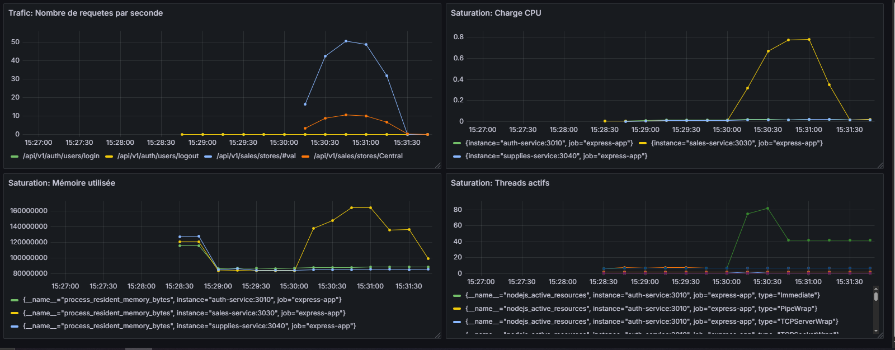
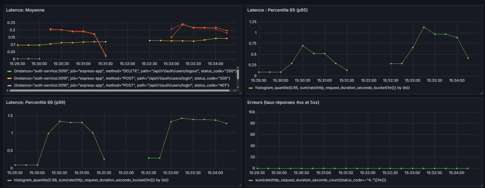
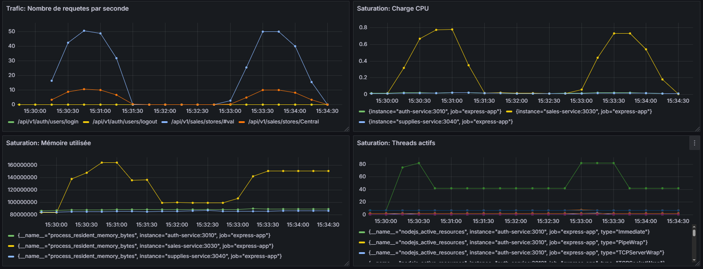
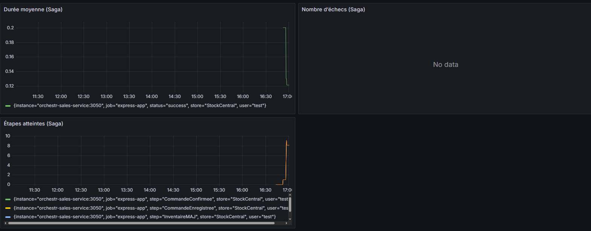
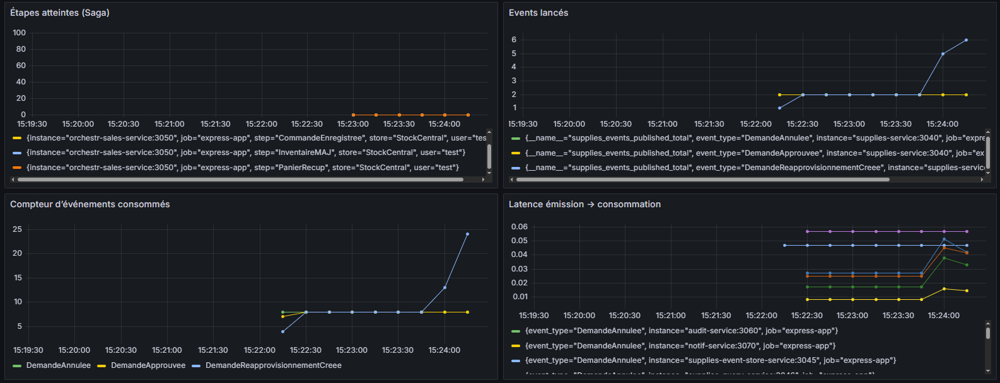
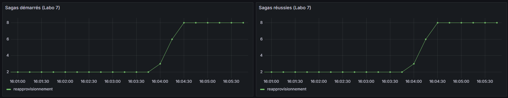
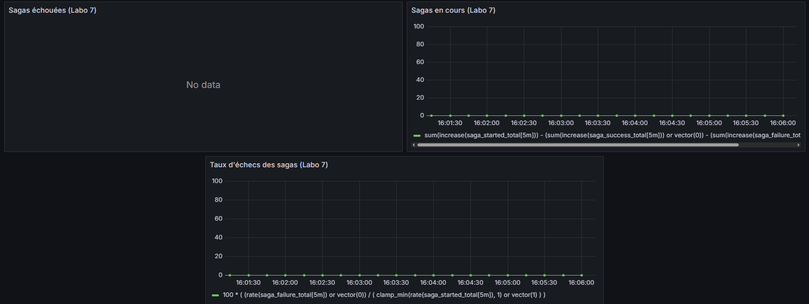
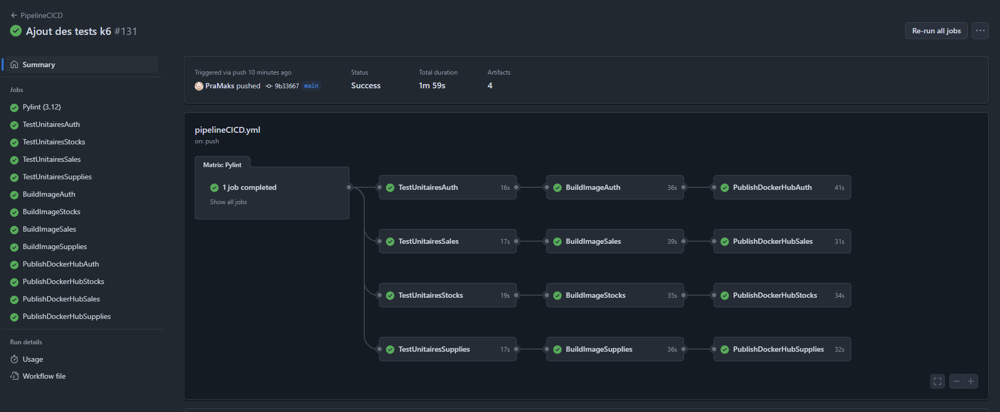

# LOG430_Labo_7

## Comment lancer le projet ?
Il faut utiliser l'environnement virtuel pour faire fonctionner le projet: "source venv/bin/activate" ou "venv/scripts/activate/ sur windows

Il faut installer toutes les dépendances pour le frontend: python3 -m pip install -r requirements.txt

Il faut installer toutes les dépendances pour le backend pour chaque service (sans rouler avec Docker): npm install

Pour lancer le frontend: lancer "python manage.py migrate" (pour avoir accès aux sessions) dans le dossier django puis ensuite "python3 manage.py runserver" pour lancer le frontend

Pour lancer le backend: installer les dépendances avec "npm install" et ensuite "node src/backend/{SERVICE_NOM}/app.js" dans chaque dossier de service (auth/stocks/sales/supplies/orchestration-sales) ou "docker compose up --build" pour lancer tous les containers à partir de la racine du projet.

Pour lancer les tests backend: "npm run test" (va lancer en mode TEST et mock la bd) dans le dossier d'un service

## C'est quoi ?

Un système de gestion d'un réseau de magasins. Permet de consulter l'inventaire, faire une recherche d'un produit, enregistrer une vente, faire un retour de vente, consulter le stock du magasin mère, générer un rapport consolidé des ventes, visualiser les performances de magasins, mettre à jour les informations d'un produit, faire une demande de réapprovisionnement, créer un compte, ajouter des produits dans le panier, confirmer la vente en tant que client à partir du contenu du panier.

## Architecture/Structure du projet

Architecture orientée en micro-services

Langage de programmation utilisé : Python (version 3.12.3)
Ce langage est préinstallé sur la VM pour ce lab. 

Technologie utilisée pour les tests unitaires : Jest et Supertest pour Express.js

Frontend: Serveur Django qui utilise Python comme langue de programmation

Load Balancing: Serveur NGINX entre le frontend et le backend pour distribuer la charge du trafic pour le service des stocks.

- 

Mise en cache: Serveur Redis pour stocker la cache comme les tokens des utilisateurs parmi tous les services

Collecte des métriques: Serveur Prometheus qui ramasse les métriques du backend de tous les services

Affichage des métriques sous forme de diagrammes dans un dashboard: Serveur Grafana utilise les métriques de Prometheus pour afficher sous forme de Dashboard, si le dashboard est absent sur le container, importer le dashboard "grafana_dashboard.json". Lorsque Grafana est ouvert la premiere fois, utiliser le compte d'utilisateur habituel (name: admin et pwd: admin) et choisir comme data source "http://prometheus:9090/" et ensuite importer le dashboard. Si le dashboard affiche des problèmes/erreurs c'est à cause des identifiants qui ont changé. Pour fix ce problème: edit chaque diagramme et juste le refresh, ça devrait regener correctement chaque diagramme.

- 
- 
- 
- 
- 
- 
- 
- 

API Gateway: KrakenD est utilisé comme gateway pour rediriger les requetes du frontend ou de Swagger/Postman vers l'instance de service disponible. Possède aussi une politique CORS.

Backend: Composé de plusieurs services utilisant un serveur Express.js chaqun et possède sa base de données MongoDB. Utilise REST API pour gérer les requêtes.

Base de données : MongoDB. C'est une base de données NoSQL, les données sont stockées sous forme de documents (comme des objets JSON). Pas besoin de schéma rigide, donc parfait pour les laboratoires à venir où la structure peut évoluer. Permet la persistance des données.

Abstraction de la couche de persistance : ODM - Open Document Mapper (pas un ORM, car la base de données est NoSQL) est utilisé. Mongoose est le ODM du projet.

Docker Compose est utilisée pour lancer l'image Docker générée. Docker est utilisée pour pouvoir créer une image Docker de l'application pour après pouvoir les lancer dans des containers indépendants. Docker compose permet aussi de lancer l'image de l'application et l'image de mongodb pour faire fonctionner l'application.

Ce projet utilise un pipeline CI/CD avec GitHub Actions après chaque push sur la branche principale (main) pour tester le code poussé. Le pipeline contient 4 jobs:

    1) PyLint pour verifier le format des fichiers .py
    2) Jest pour lancer les tests unitaires et verifier qu'il n'y a pas d'erreurs de logique sur chaque service (9 jobs isolés)
    3) Création et sauvegarde (comme un artifact) d'une image Docker de l'application de chaque service (9 jobs isolés)
    4) Utilisation de l'image Docker stoquée comme un artifact et push de celle-ci sur Docker Hub de chaque service (9 jobs isolés)

Le lien vers les images Docker sur Docker Hub : https://hub.docker.com/repository/docker/pramaks/

Cette image lance le côté backend de l'application (Express.js)

## Comment construire et lancer le conteneur Docker à l'aide de Docker Compose?

Version de Docker utilisée: version 28.1.1, build 4eba377

Version de Docker Compose utilisée : version 2.35.1

Pour lancer et build le tout avec Docker Compose : "docker compose up --build" ceci est fait pour faciliter le lancement de l'ensemble du système,
sinon lancer la même commande dans le dossier d'un service pour lancer uniquement ce service.

## Réussite des jobs sur le pipeline CI/CD

La réussite des jobs sur le pipeline CI/CD peuvent aussi être visionnées dans le repo GitHub : https://github.com/PraMaks/LOG430_Labo_0/actions

## Comment accéder à la documentation Swagger UI ?

Aller sur:
- Auth Service: "http://localhost:3010/api/v1/api-docs/"
- 
- Stocks Service: "http://localhost:3020/api/v1/api-docs/"
- 
- Sales Service: "http://localhost:3030/api/v1/api-docs/"
- 
- Supplies Service: "http://localhost:3040/api/v1/api-docs/"
- 
- Orchestr-Sales Service: "http://localhost:3050/api/v1/api-docs/"
- 
- Audit Service: "http://localhost:3060/api/v1/api-docs/"
- 
- Supplies-Event-Store: "http://localhost:3045/api/v1/api-docs/"
- 
- Supplies-Query Service: "http://localhost:3046/api/v1/api-docs/"
- 

## Saga pour le labo 6:

Enregistrement de la commande en ligne.
Voici les étapes:
- Récuperer le panier (stocks-service)
- Enregistrer la vente (sales-service)
- Mettre à jour l'inventaire (stocks-service)
- Metre à jour l'utilisateur (auth-service)

## Saga pour le labo 7:

Traitement d'une demande de réapprovisionnement
Containers concernées:
- Supplies
- RabbitMQ
- Audit
- Notif
- Supplies-Event-Store
- Supplies-Query