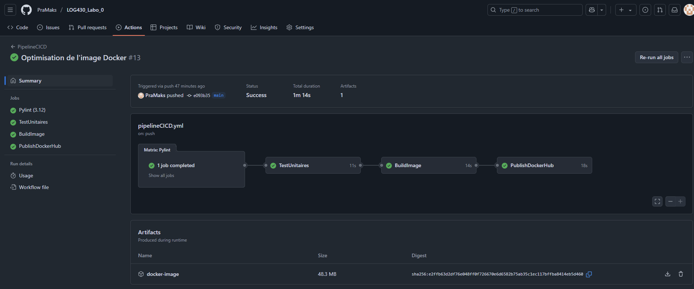

# LOG430_Labo_0

## C'est quoi ?

Une mini application Python qui fait l'addition de 2 nombres avec 2 tests unitaires de Pytest.

## Architecture/Structure du projet

Langage de programmation utilisé : Python (version 3.12.3)
Ce langage est préinstallé sur la VM pour ce lab. 

Technologie utilisée pour les tests unitaires (en Python) : Pytest (version 7.4.4). Ce framework de tests unitaires est documenté et populaire dans les autres projets.

Application principale est dans le fichier : main.py. Celle-ci permet de faire l'addition de 2 nombres.

Fichier pour lancer les tests unitaires : test_pytest.py. Celui-ci contient 2 tests unitaires (addition avec 2 nombres positives et addition avec 2 nombres négatives).

Docker est utilisé pour générer une image de l'application (main.py). Le modèle de l'image Docker utilisé est "python:3.12-slim" qui permet de générer une image lègère et optimisée.

Docker Compose est utilisée pour lancer l'image Docker générée. Docker est utilisée pour pouvoir créer une image Docker de l'application pour après pouvoir les lancer dans des containers indépendants. Cela serait utile plus tard dans ce cours, lorsque l'application serait plus complexe.

Ce projet utilise un pipeline CI/CD avec GitHub Actions après chaque push sur la branche principale (main) pour tester le code poussé. Le pipeline contient 4 jobs:

    1) PyLint pour verifier le format des fichiers .py
    2) Pytest pour lancer les tests unitaires et verifier qu'il n'y a pas d'erreurs de logique
    3) Création et sauvegarde (comme un artifact) d'une image Docker de l'application 
    4) Utilisation de l'image Docker stoquée comme un artifact et push de celle-ci sur Docker Hub

Le lien vers l'image Docker sur Docker Hub : https://hub.docker.com/repository/docker/pramaks/python-addition-app/

## Comment cloner le projet et lancer le projet ?

Avec git d'installé sur le poste, lancer "git clone https://github.com/PraMaks/LOG430_Labo_0.git" dans une ligne de commandes (Git Bash recommandé)

Si Pytest n'est pas installé sur le poste: lancer "sudo apt install python3-pytest" ou utiliser pip comme alternative

Pour lancer l'application: À partir de la racine de ce projet lancer : "python3 main.py"

Pour lancer les tests unitaires: À partor de la racine de ce projet lancer : "pytest"

## Comment construire et lancer le conteneur Docker à l'aide de Docker Compose?

Version de Docker utilisée: version 28.1.1, build 4eba377

Version de Docker Compose utilisée : version 1.29.2

Pour créer l'image Docker (à partir du root de l'application) : lancer "docker build -t python-addition-app ."

Pour verifier que l'image Docker s'est correctement crée (à partir du root de l'application) : lancer "docker images"

Pour lancer "main.py" sur l'image Docker (à partir du root de l'application) : lancer "docker run --rm python-addition-app python main.py"

Pour lancer test_pytest.py sur l'image Docker (à partir du root de l'application) : lancer "docker run --rm python-addition-app"

Pour lancer l'image avec Docker Compose (à partir du root de l'application) : lancer "docker-compose up --build"

Pour fermer les containers de Docker Compose : docker-compose down

## Réussite des jobs sur le pipeline CI/CD

La réussite des jobs sur le pipeline CI/CD peuvent aussi être visionnées dans le repo GitHub : https://github.com/PraMaks/LOG430_Labo_0/actions

