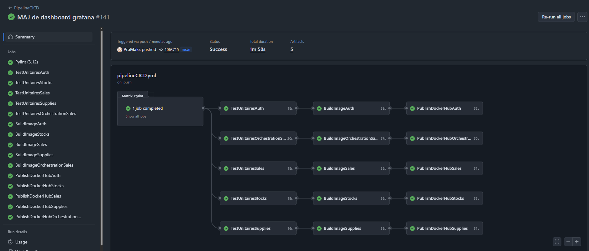

# LOG430_Labo_3

## Comment lancer le projet ?
Il faut utiliser l'environnement virtuel pour faire fonctionner le projet: "source venv/bin/activate"

Il faut installer toutes les dépendances: python3 -m pip install -r requirements.txt

Pour lancer le frontend: lancer "python manage.py migrate" (pour avoir accès aux sessions) dans le dossier django puis ensuite "python3 manage.py runserver"

Pour lancer le backend: installer les dépendances avec "npm install" et ensuite "node src/backend/app.js" ou "docker compose up --build"

Pour lancer les tests backend: "npm test" (va lancer en mode TEST et mock la bd)

## C'est quoi ?

Un système de gestion d'un réseau de magasins. Permet de consulter l'inventaire, faire une recherche d'un produit, enregistrer une vente, faire un retour de vente, consulter le stock du magasin mère, générer un rapport consolidé des ventes, visualiser les performances de magasins, mettre à jour les informations d'un produit, faire une demande de réapprovisionnement.

## Architecture/Structure du projet

Une application Python avec architecture à trois niveaux

Langage de programmation utilisé : Python (version 3.12.3)
Ce langage est préinstallé sur la VM pour ce lab. 

Technologie utilisée pour les tests unitaires : Jest et Supertest pour Express.js

Frontend: Serveur Django qui utilise Python comme langue de programmation

Load Balancing: Serveur NGINX entre le frontend et le backend pour distribuer la charge du trafic.

Mise en cache: Serveur Redis pour stocker la cache comme les tokens des utilisateurs parmi plusieurs instances Express.js

Collecte des métriques: Serveur Prometheus qui ramasse les métriques du backend 

Affichage des métriques sous forme de diagrammes dans un dashboard: Serveur Grafana utilise les métriques de Prometheus pour afficher sous forme de Dashboard, si le dashboard est absent sur le container, importer le dashboard "grafana_dashboard.json"

Backend: Serveur Express.js sera utilisé comme intérmédiaire entre le frontend Python et la base de données MongoDB. Utilise REST API pour gérer les requêtes.

Base de données : MongoDB. C'est une base de données NoSQL, les données sont stockées sous forme de documents (comme des objets JSON). Pas besoin de schéma rigide, donc parfait pour les laboratoires à venir où la structure peut évoluer. Permet la persistance des données.

Abstraction de la couche de persistance : ODM - Open Document Mapper (pas un ORM, car la base de données est NoSQL) est utilisé. Mongoose est le ODM du projet.

Docker Compose est utilisée pour lancer l'image Docker générée. Docker est utilisée pour pouvoir créer une image Docker de l'application pour après pouvoir les lancer dans des containers indépendants. Docker compose permet aussi de lancer l'image de l'application et l'image de mongodb pour faire fonctionner l'application.

Ce projet utilise un pipeline CI/CD avec GitHub Actions après chaque push sur la branche principale (main) pour tester le code poussé. Le pipeline contient 4 jobs:

    1) PyLint pour verifier le format des fichiers .py
    2) Jest pour lancer les tests unitaires et verifier qu'il n'y a pas d'erreurs de logique
    3) Création et sauvegarde (comme un artifact) d'une image Docker de l'application 
    4) Utilisation de l'image Docker stoquée comme un artifact et push de celle-ci sur Docker Hub

Le lien vers l'image Docker sur Docker Hub : https://hub.docker.com/repository/docker/pramaks/labo3-express-magasin-app

Cette image lance le côté backend de l'application (Express.js)

## Comment construire et lancer le conteneur Docker à l'aide de Docker Compose?

Version de Docker utilisée: version 28.1.1, build 4eba377

Version de Docker Compose utilisée : version 2.35.1

Pour lancer et build le tout avec Docker Compose : "docker compose up --build"

## Réussite des jobs sur le pipeline CI/CD

La réussite des jobs sur le pipeline CI/CD peuvent aussi être visionnées dans le repo GitHub : https://github.com/PraMaks/LOG430_Labo_0/actions

## Comment accéder à la documentation Swagger UI ?

Aller sur "http://localhost:3000/api/v1/api-docs/"

